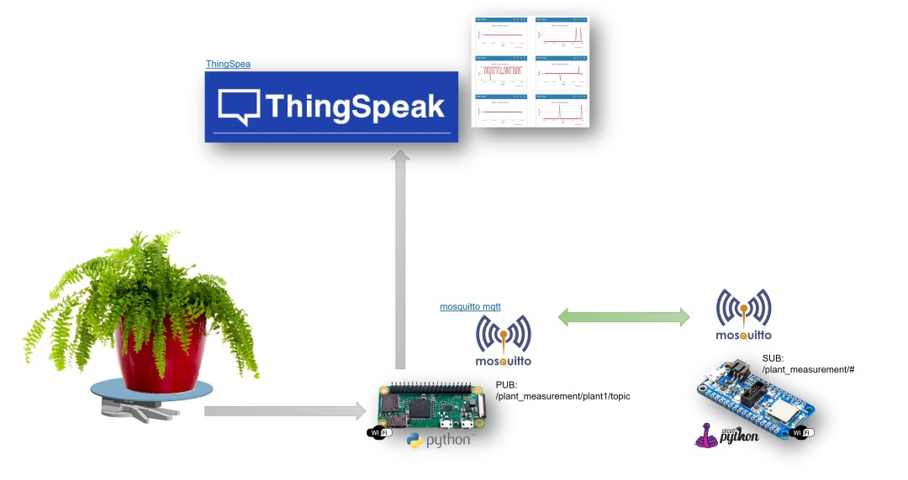

# weight measurement (idb-iot)
Internet of things
by rootpi

## Description
..

## Overview - Software
<table><tr><td></td></tr></table>

## Overview - Hardware
<table><tr><td></td></tr></table>

## Overview - Assembly
LoadCell Support
<table><tr><td></td></tr></table>
ServoArm Support
<table><tr><td></td></tr></table>

..
